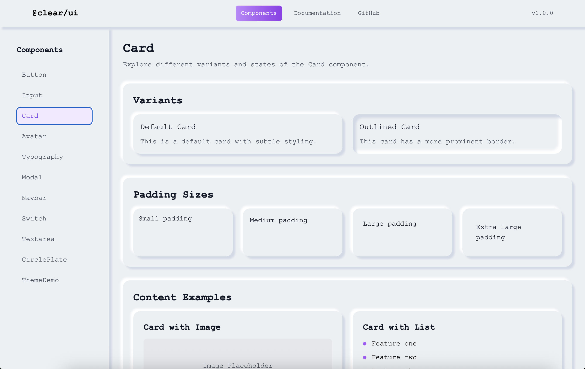

# Clear UI Library

A modern React component library with neumorphic design, using a zero-runtime approach to styles.

## Features

- 🎨 **Neumorphic Design** - modern style with soft shadows
- ⚡ **Zero-runtime CSS** - all styles are compiled into CSS files
- 🧩 **TypeScript** - full typing for all components
- 📱 **Responsive** - adaptive design
- 🎯 **Accessible** - accessibility support
- 🧪 **Tested** - test coverage

## Installation

```bash
npm install @clear/ui
```

### Demo Application

```bash
npm run demo
```



## Usage

### Automatic Style Import

Styles are automatically imported when using the library. No additional CSS import is required.

### Basic Usage

```tsx
import { Button, Input, Card } from '@clear/ui';

function App() {
  return (
    <div>
      <Button variant="primary">Click me</Button>
      <Input placeholder="Enter text..." />
      <Card>
        <h2>Card Title</h2>
        <p>Card content</p>
      </Card>
    </div>
  );
}
```

## Components

### Button

```tsx
import { Button } from '@clear/ui';

// Sizes
<Button size="sm">Small</Button>
<Button size="md">Medium</Button>
<Button size="lg">Large</Button>
<Button size="xl">Extra Large</Button>

// Variants
<Button variant="primary">Primary</Button>
<Button variant="ghost">Ghost</Button>
<Button variant="concave">Concave</Button>
<Button variant="gradient">Gradient</Button>
```

### Input

```tsx
import { Input } from '@clear/ui';

// Sizes
<Input size="sm" placeholder="Small input" />
<Input size="md" placeholder="Medium input" />
<Input size="lg" placeholder="Large input" />
<Input size="xl" placeholder="Extra large input" />

// Styles
<Input rounded placeholder="Rounded input" />
<Input neumorphic placeholder="Neumorphic input" />
<Input error placeholder="Error input" />
```

### Switch

```tsx
import { Switch } from '@clear/ui';

function MyComponent() {
  const [checked, setChecked] = useState(false);

  return (
    <Switch 
      checked={checked} 
      onChange={setChecked}
      disabled={false}
    />
  );
}
```

### Card

```tsx
import { Card } from '@clear/ui';

// Variants
<Card variant="default">Default card</Card>
<Card variant="outlined">Outlined card</Card>

// Padding sizes
<Card padding="sm">Small padding</Card>
<Card padding="md">Medium padding</Card>
<Card padding="lg">Large padding</Card>
<Card padding="xl">Extra large padding</Card>

// Rounded corners
<Card rounded>Rounded card</Card>
```

### Modal

```tsx
import { Modal } from '@clear/ui';

function MyComponent() {
  const [isOpen, setIsOpen] = useState(false);

  return (
    <Modal 
      isOpen={isOpen} 
      onClose={() => setIsOpen(false)}
      title="Modal Title"
      size="md"
    >
      <p>Modal content goes here</p>
    </Modal>
  );
}
```

### Navbar

```tsx
import { Navbar } from '@clear/ui';

const links = [
  { href: '/', label: 'Home', active: true },
  { href: '/about', label: 'About' },
  { href: '/contact', label: 'Contact' },
];

function MyNavbar() {
  return (
    <Navbar
      logo={<h1>Logo</h1>}
      links={links}
      actions={<Button>Login</Button>}
    />
  );
}
```

### Typography

```tsx
import { Typography } from '@clear/ui';

<Typography variant="h1">Heading 1</Typography>
<Typography variant="h2">Heading 2</Typography>
<Typography variant="body">Body text</Typography>
<Typography variant="caption">Caption text</Typography>

// Colors
<Typography color="primary">Primary text</Typography>
<Typography color="secondary">Secondary text</Typography>
<Typography color="accent">Accent text</Typography>

// Weight
<Typography weight="normal">Normal weight</Typography>
<Typography weight="medium">Medium weight</Typography>
<Typography weight="bold">Bold weight</Typography>
```

### Avatar

```tsx
import { Avatar } from '@clear/ui';

// With image
<Avatar src="/path/to/image.jpg" alt="User avatar" />

// With fallback text
<Avatar fallback="John Doe" />

// Sizes
<Avatar size="sm" fallback="JD" />
<Avatar size="md" fallback="JD" />
<Avatar size="lg" fallback="JD" />
<Avatar size="xl" fallback="JD" />
```

### CirclePlate

```tsx
import { CirclePlate } from '@clear/ui';

// Variants
<CirclePlate variant="primary">Primary</CirclePlate>
<CirclePlate variant="concave">Concave</CirclePlate>

// Sizes
<CirclePlate size="sm">Small</CirclePlate>
<CirclePlate size="md">Medium</CirclePlate>
<CirclePlate size="lg">Large</CirclePlate>
<CirclePlate size="xl">Extra Large</CirclePlate>
```

### Textarea

```tsx
import { Textarea } from '@clear/ui';

<Textarea 
  placeholder="Enter your message..."
  rows={4}
  size="md"
  error={false}
/>
```

### FormField

```tsx
import { FormField, Input } from '@clear/ui';

<FormField 
  label="Email" 
  error="Please enter a valid email"
  required
>
  <Input type="email" placeholder="Enter your email" />
</FormField>
```

## Zero-Runtime CSS

The library uses a zero-runtime approach to styles:

- All styles are compiled into CSS files
- No runtime overhead from styled-components
- Better performance
- Smaller bundle size

### CSS Classes

Main CSS classes for neumorphic styles:

```css
/* Backgrounds */
.bg-neumorphism-background
.bg-neumorphism-classic

/* Shadows */
.shadow-neumorphism
.shadow-neumorphism-inset
.shadow-neumorphism-card
.shadow-neumorphism-input
.shadow-neumorphism-concave

/* Components */
.input-base
.switch-container
.card
.cssbuttons-io
```

### Manual CSS Import (Optional)

If you need to import CSS manually (for example, for customization), you can use:

```tsx
import '@clear/ui/styles';
```

## Development

### Installing Dependencies

```bash
npm install
```

### Running in Development Mode

```bash
npm run dev
```

### Building

```bash
npm run build
```

### Tests

```bash
npm test
```

## License

```bash

```

MIT
